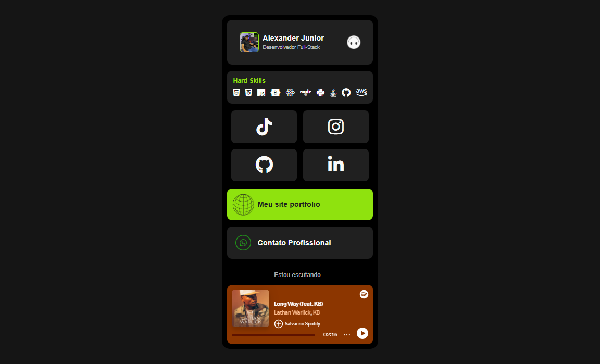

# LinkBio - Alexander Junior │ Desenvolvedor Full-Stack

Este é um site pessoal desenvolvido por Alexander Junior para centralizar links importantes e destacar habilidades e projetos. A página inclui widgets com informações pessoais, habilidades técnicas, links para redes sociais, e muito mais.

# Imagem do Projeto


## Características

- **Loading Screen Customizado:** Uma tela de carregamento animada que mostra o progresso em porcentagem até que o site esteja completamente carregado.
- **Perfil do Usuário:** Informações do desenvolvedor com foto, nome e título.
- **Habilidades Técnicas:** Ícones de tecnologias que destacam as hard skills do desenvolvedor.
- **Links para Redes Sociais:** Links diretos para TikTok, Instagram, GitHub e LinkedIn.
- **Widget de Marca Pessoal:** Espaço para linkar projetos ou páginas pessoais relevantes.
- **Portfólio e Freelancer:** Links para o site de portfólio pessoal e contatos profissionais.

## Tecnologias Utilizadas

- HTML5
- CSS3
- JavaScript
- FontAwesome para ícones
- Roboto Font do Google Fonts

## Estrutura de Arquivos
```
LINK-BIO/
├── img/                    # Pasta contendo imagens do projeto
│   ├── smile-icon.png          # Ícone de sorriso
│   ├── web-black-icon.png      # Ícone web com fundo preto
│   ├── whatsapp-icon.png       # Ícone do WhatsApp
│   ├── xanzin foto.png         # Outra imagem utilizada no projeto
│
├── animationLoading.js     # Script para animação de carregamento
├── index.html              # Arquivo principal do site
├── README.MD               # Arquivo de documentação do projeto
├── style.css               # Arquivo de estilos CSS
```
## Autor

**Alexander Junior**  

- [GitHub](https://github.com/alexanderjr02)  
- [LinkedIn](https://www.linkedin.com/in/alexander-j%C3%BAnior/)  
- [Instagram](https://www.instagram.com/xanzin_?igsh=MXdmYm14d2R3dm14bg==)  
